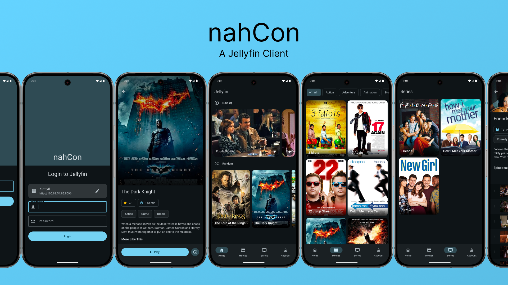

# nahCon [WIP]


A Jellyfin video client made using Flutter.

## Downloads

Now available on

<a href='https://play.google.com/store/apps/details?id=com.nahnah.nahcon'></a>

*or*

[Github Release](https://github.com/Nandanrmenon/nahcon/releases)
## Features
- [x] Login into your Jellyfin server
- [x] Display Library
- [x] Filter Media
- [x] Search Media
- [x] Stream Media (requires a lot of testing)
- [x] Change Video/Audio/Subtitle track (buggy but works)
- [ ] Download media onto the device
- [x] Continue watching
- [ ] Add to watch later
- [x] Show TV shows
- [x] Multi user account


## Platform
- [x] Android
- [x] iOS (Test on iPad)
- [x] macOS
- [ ] Linux
- [ ] Windows

## Supporting
If you’d like to support me and the development of this application (I appreciate it!), here is my Ko-Fi link!

<a href='https://ko-fi.com/P5P41KEC9N' target='_blank'></a>


## Compiling the app
Before anything, be sure to have a working flutter sdk setup.If not installed, go to [Install - Flutter](https://docs.flutter.dev/get-started/install).

Be sure to disable signing on build.gradle or change keystore to sign the app.

For now the required flutter channel is master, so issue those two commands before starting building:
```
$ flutter channel master
```
```
$ flutter upgrade
```

After that, building is simple as this:
```
$ flutter pub get
```
```
$ flutter run
```
```
$ flutter build platform-name
```

## Contributing

Feel free to open a PR to suggest fixes, features or whatever you want, just remember that PRs are subjected to manual review so you gotta wait for actual people to look at your contributions.